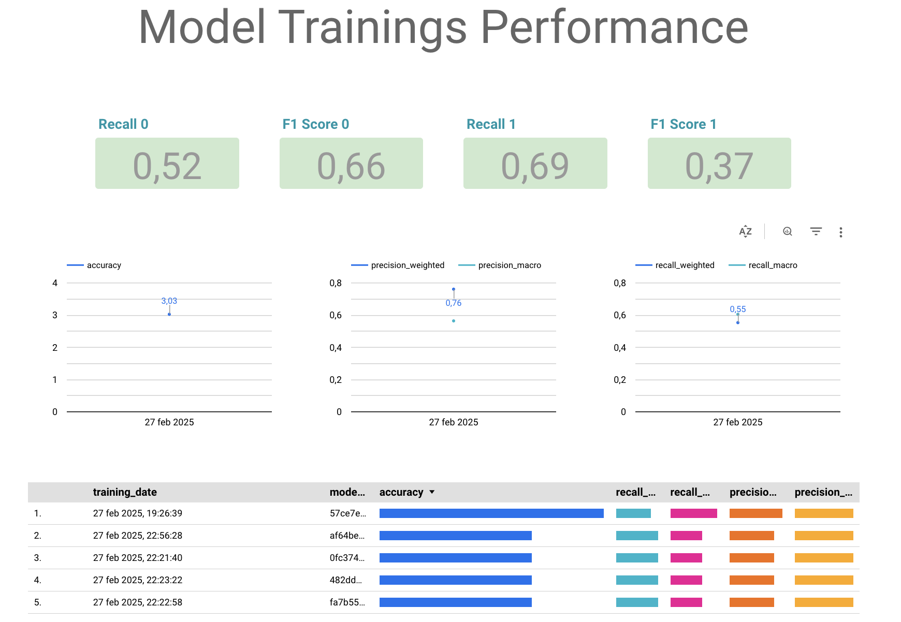
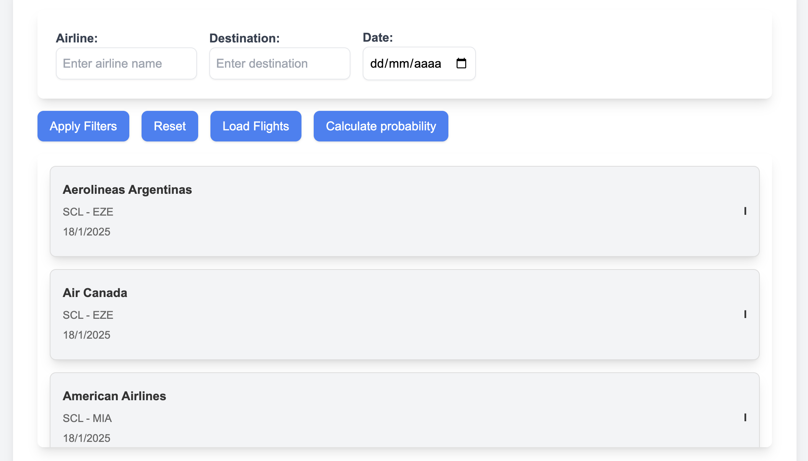
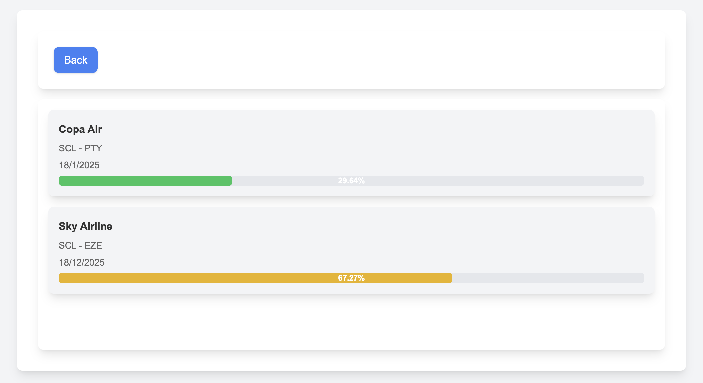

# Technical Test Solution

## Context

The objective of this test was to operationalize a machine learning model to predict flight delays for an airport team. The solution involved four main parts:

- Part I: Transcribing the model from a `.ipynb` to a `.py` file.
- Part II: Deploying the model in an API using FastAPI.
- Part III: Deploying the API in a cloud provider.
- Part IV: Implementing CI/CD for automated testing and deployment.

## Part I: Transcribing the Jupyter Notebook to a Python Script

### Objective:
The first step in operationalizing the model was to transcribe the Jupyter notebook (`.ipynb`) file into a Python script (`model.py`) to prepare the model for deployment.

### Approach:
I converted the code from the notebook into functions and classes in a Python script, ensuring that the model training, evaluation, and prediction processes were encapsulated into reusable components. The data loading and preprocessing were also modularized, making it easier to maintain and extend the code.

### Conclusion:
The model was successfully transcribed into a Python script, allowing it to be executed independently of the notebook environment and prepared for deployment in an API.

## Part II: Deploying the Model in an API with `FastAPI`

### Objective:
The goal of this part was to wrap the model into a web service using FastAPI, ensuring it could handle requests for flight delay predictions and also provide functionality for training the model with either local or cloud-stored data.

### Approach:
1. **Input Data Validation:**
   I used Pydantic to validate the input data. This ensures that the data passed to the API is in the correct format and prevents errors during model inference.

2. **Training the Model:**
   I implemented an endpoint that allows training the model with either:
   - Data stored locally within the Docker container.
   - Data from Google Cloud Storage (GCS), specified via a parameter in the training endpoint.

   This flexibility allows the model to be trained with different data sources, depending on the environment and use case.

3. **Model Updates and Storage:**
   Each time a model is trained, it updates the `DelayModel` class and:
   - Saves the trained model as a pickle file in GCS for persistence.
   - Stores model performance metrics (e.g., accuracy, recall) in BigQuery for future analysis.

4. **Force Model Update:**
   I implemented an endpoint that allows for "forcing" the update of the model in the `DelayModel` class. By passing the UUID of a model stored in GCS, this endpoint retrieves the model from Cloud Storage and updates the class with the new model.

5. **Predict Proba:**
   I implemented an endpoint to return the probability of delay and integrated it into a frontend to visualize the model's predictions.

6. **Logging and Error Handling:**
   I implemented logging using GCP's logging service to track errors and API behavior. While I only added a sample of logs for demonstration, the system is ready to log any errors or important events.

7. **Stress Testing and Performance Optimization:**
   The API underwent a stress test for the `predict` endpoint. The 90th percentile latency was around 450 milliseconds. To optimize this, I implemented Redis caching in GCP:
   - The `predict` endpoint now caches the predictions in Redis, reducing redundant computation.
   - After implementing Redis, I ran the test again locally, achieving a 90th percentile latency of approximately 120 milliseconds. When deployed on GCP, the latency was around 150 milliseconds.

8. **Local Testing with Docker Compose:**
   To facilitate local testing, I created a `docker-compose.yml` file that:
   - Builds the API image and links it to a Redis image.
   - Allows running both the API and Redis locally for testing the caching mechanism and other functionality.
   
9. **Package Management with Poetry:**
   For managing dependencies, I used Poetry, which is reflected in the `Dockerfile`. Poetry is used to install the necessary packages for the API and model training, ensuring a consistent and isolated environment for development.

### Conclusion:
The API not only serves the trained model but also allows for training with different data sources, tracks metrics, logs errors, and can "force" an update of the model from Cloud Storage. Redis caching significantly improved the latency, making the API more responsive under stress conditions. The local testing setup with Docker Compose and package management via Poetry further streamlined the development and testing process.

## Part III: Deploying the API in GCP

### Objective:
The task was to deploy the API in the cloud, specifically using Google Cloud Platform (GCP), to ensure the service could handle real-world traffic and be accessible for predictions.

### Approach:
1. **Using the GCP CLI:**
   I used the GCP CLI to handle the deployment process. This included setting up the necessary resources and deploying the API service.

2. **Building the Artifact:**
   I built the Docker artifact for the API and stored it in Google Container Registry (GCR), ensuring that the container image was accessible for deployment.

3. **Deploying to Cloud Run:**
   I deployed the built Docker image to GCP's Cloud Run service. Cloud Run provides a fully managed environment to run containerized applications with auto-scaling and high availability.

4. **Testing the API:**
   After deployment, I sent requests to the API and verified that the predictions were returned correctly. Everything worked as expected, confirming that the deployment was successful.

### Conclusion:
The deployment process was smooth, and after deploying the API to Cloud Run, it was fully operational. The service could handle requests, and everything functioned as expected in the cloud environment.

## Part IV: CI/CD Implementation

### Objective:
The goal was to implement continuous integration and continuous deployment (CI/CD) to automate testing, building, and deploying the application. This ensures that the code is always in a deployable state and that the deployment process is smooth and automated.

### Continuous Integration (CI):
1. **Pipeline Execution:**
   A GitHub Actions pipeline was created to run automatically on every pull request to the `develop` or `main` branches.

2. **Build and Test:**
   In this pipeline:
   - The Docker image is built from the source code.
   - The required packages are installed using Poetry.
   - The tests that were provided in the technical test (which validate the model and the API) are executed.

3. **Linter:**
   To maintain good coding practices, a linter check is included in the pipeline. This ensures that the code adheres to the style guidelines and avoids common errors.

### Continuous Deployment (CD):
1. **Pipeline Execution:**
   A second pipeline was created to run only when a merge is made to the `main` branch. This pipeline automates the deployment process.

2. **Building the Artifact:**
   In the CD pipeline, the Docker artifact is also created, just like in the CI pipeline, ensuring that the correct image is built and ready for deployment.

3. **Deploying the Artifact:**
   After the artifact is built, it is saved and deployed to Google Cloud Run, ensuring the most up-to-date version of the API is always live.

### Conclusion:
The CI/CD pipelines ensure a seamless workflow, where code is automatically tested, built, and deployed. This minimizes manual intervention and guarantees that the code is always in a deployable state, while maintaining high-quality standards through automated linting and testing.

## Model Selection

During model evaluation, six models were analyzed, including Logistic Regression and variations of XGBoost. The key finding was that balancing the classes improved recall for the minority class (Class 1), which is crucial for predicting flight delays.

XGBoost model, with the 10 most important features and class balancing, was chosen for operationalization due to its superior ability to handle large datasets, robustness against missing values, and efficiency in managing feature importance. Additionally, it provided the best balance between recall and other performance metrics, making it the most reliable choice for this task.

## GCP Infrastructure and Storage

To store and manage the trained models and their corresponding metrics, Google Cloud Storage (GCS) was utilized for persistent model storage, where each trained model is saved as a pickle file. Model performance metrics were stored in BigQuery to allow for future analysis and tracking of model improvements over time. This setup ensures that models are easily retrievable and that historical performance data can be queried for insights and monitoring.

Additionally, a dashboard was created in Looker Studio to monitor the performance metrics of the trained models. This dashboard provides a visual representation of the model's key metrics, such as accuracy, recall, and precision, over time. It allows stakeholders to track model performance and make informed decisions based on the data. The dashboard can be accessed at the following link: [https://lookerstudio.google.com/reporting/4eb39aff-4613-4f45-86ff-e4eaf8217fde](https://lookerstudio.google.com/reporting/4eb39aff-4613-4f45-86ff-e4eaf8217fde).



## Google Apps Script Frontend

### Objective:
To provide a user-friendly way to interact with the model, I created a frontend using Google Apps Script.

### Approach:
- The frontend is accessible via the following link: [https://script.google.com/macros/s/AKfycbwtZnmrpLUPWNrox27VN2XNxTxDQR7BmADE_9uQPEB_cwvU5sXod_oEMj6BtvsY5J3W/exec](https://script.google.com/macros/s/AKfycbwtZnmrpLUPWNrox27VN2XNxTxDQR7BmADE_9uQPEB_cwvU5sXod_oEMj6BtvsY5J3W/exec). And allows users to query flight delay probabilities easily.

- It loads flight data from a BigQuery table and displays it in a user interface.

- The script sends requests to the deployed API, retrieving the predicted probability of delay for each flight.

- The response is processed and displayed in the frontend, helping users make data-driven decisions based on real-time predictions.

### Conclusion:
This frontend enhances the usability of the solution, providing a simple way to access and visualize predictions directly .



*Figure 1: This screen allows users to select flights from BigQuery before sending a request to the API for delay probability predictions.*



*Figure 2: This screen allows users to visualize predictions.*

## Scalability Considerations

The use of Google Cloud Run provides auto-scaling, meaning that the API can handle variable levels of traffic without requiring manual intervention. Redis was added as a caching layer to further optimize performance, especially for frequently requested predictions. This caching mechanism not only reduces latency but also ensures that the service can scale efficiently even under heavy load.

## Future Improvements

- **Model Retraining Strategy**: Implementing a scheduled retraining pipeline to periodically update the model with fresh data to adapt to changing patterns.
- **Automated Monitoring**: Adding monitoring for model performance in production, including real-time logging of predictions, errors, and performance degradation over time.
- **Feature Expansion**: Exploring additional features and external datasets to improve prediction accuracy and robustness.

## Testing Locally

To test the application locally, you have two options:

### 1. Using Docker Compose:
You can use the `docker-compose.yml` file to build the images and run the services locally. Here’s a step-by-step guide:
1. Clone the repository and navigate to the project directory.
2. Build and start the containers:
   ```bash
   docker-compose up --build
3. This will build the Docker images for both the API and Redis, and run them in the background.
4. Once the services are up, you can test the API by sending requests to http://localhost:8080.

###  2. Using PyCharm:
If you prefer to run the project from an IDE like PyCharm, follow these steps:

1. Install the required dependencies:
   - If you’re using Poetry, run:
      ```bash
      poetry install

   - Or, if you're using pip, install the packages from final_requirements.txt
     ```bash
     pip install -r final_requirements.txt

2. Launch the project in PyCharm.
3. If you run the API in PyCharm, make sure to modify the paths in services.py to use relative paths starting with ../ instead of ./, as the file structure may be different.
By following these steps, you can test the application locally using Docker or PyCharm, ensuring that the functionality works as expected before deploying it to the cloud.